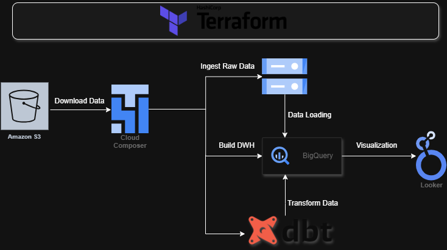

# Divvy Bikes Pipeline

## Project Overview
Divvy Bikes Pipeline is a cloud-native data pipeline that automates the monthly ingestion, processing, and transformation of Divvy bike trip data using Google Cloud Platform services. Leveraging Terraform for infrastructure provisioning, Secret Manager for secure credential storage, Cloud Composer (Airflow) for orchestration, and BigQuery for storage and analytics, this project delivers an end-to-end solution for managing and analyzing bicycle sharing data.

## Problem Description
### The Challenge
- **Data Acquisition Complexity:** Divvy bike trip data is published monthly as CSV files in an S3 bucket requiring manual download and version management.
- **Pipeline Orchestration:** Coordinating multiple steps (download, unzip, load to GCS, create external tables, merge into managed tables, and run DBT transformations) without a robust scheduler is error-prone.
- **Secure Credential Handling:** Storing and accessing service account credentials securely across pipeline components.

### How This Project Solved It
- **Automated Infrastructure Provisioning:** Terraform code provisions GCS buckets, BigQuery dataset, Cloud Composer environment, and Secret Manager resources.
- **Secure Credential Management:** Service account key stored in Secret Manager; accessed dynamically by Airflow tasks.
- **Orchestrated Workflow:** Airflow DAG scheduled monthly on the 15th automates the full ingestion and transformation pipeline.
- **Data Warehousing Best Practices:** BigQuery external tables, managed tables with partitioning and clustering optimize query performance.
- **Modular Data Transformations:** DBT runs post-loading to build analytics-ready models in BigQuery.

## Project Design


### Benefits of This Design
- **End-to-End Automation:** Terraform and Airflow ensure minimal manual intervention.
- **Scalability:** Composer environment scales with workload; BigQuery handles petabyte-scale data.
- **Reliability & Observability:** Airflow retries, catchup, and branching logic handle edge cases; Secret Manager secures credentials.
- **Modularity:** Clear separation between infrastructure (Terraform), orchestration (Airflow), and transformations (DBT).
- **Performance Optimization:** Partitioned and clustered tables accelerate analytic queries.

## Prerequisites
- **Terraform**
- **Google Cloud Platform Account** with:
  - Service Account with roles: BigQuery Admin, Storage Admin, Composer Admin, Secret Manager Secret Accessor, Service Account User.
  - Note That you can use Service Account with Owner Role for simplicity

## Project Structure
```
.
├── terraform
│   ├── main.tf                 # Infrastructure-as-Code for GCS, BigQuery, Composer, Secret Manager
│   ├── variables.tf            # Input variables (project_id, region_name, bucket_name, dataset_name, etc.)
│   │── assets
│   │   └── bikes_pipeline.py   # Airflow Dag Code File
│   └── keys
│       └── gcp_cred.json       # File to place your service account key
└── dbt_project
    └── models  # Directory containing the dbt model files
```

## How To Run?
1. **Clone the repository**  
   ```bash
   git clone <repo-url>
   cd <repo>/terraform
   ```

2. **Configure variables**  
   Edit `variables.tf` to setup your Project ID, Service account, etc.

3. **Get service account key**  
   Put your service account key in "<repo>/terraform/keys/gcp_cred.json

4. **Initialize and apply Terraform**  
   ```bash
   terraform init
   terraform apply -auto-approve
   ```

5. **Verify Airflow Environment**  
   - Open Cloud Composer Airflow UI.
   - Ensure `Divvy_Bikes_Pipeline_Orch` DAG is present and unpaused.
   - Monitor DAG runs on the 15th of each month or trigger manually.

## Airflow For Orchestration
The Airflow DAG `Divvy_Bikes_Pipeline_Orch` includes the following tasks:


1. `download_data`: Downloads the previous month's Divvy trip data ZIP from S3.
2. `unzip_data`: Extracts the CSV file locally.
3. `upload_to_gcs`: Uploads CSV to GCS bucket.
4. `delete_external_table`: Removes any existing BigQuery external table.
5. `create_external_table`: Creates an external table pointing to GCS data.
6. `create_managed_table`: Creates a partitioned & clustered managed table in BigQuery.
7. `merge_data`: MERGE operation inserts new records from external to managed table.
8. `branching_condition`: Branches to trigger next ingestion run or skip.
9. `write_sa_key_to_file`: Retrieves SA key from Secret Manager.
10. `setup_dbt_profile`, `clone_repo`, `run_dbt`: Configures DBT, clones transformation repo, runs DBT models.

## Transformations Using DBT
DBT models in the cloned repository transform raw Divvy trip data into analytics-ready tables, including:
- `Avg_Trip_Duration_DOW`: Average Trip Duration Aggregated by Day of Week.
- `Top_Start_Stations_Weekly`: Aggregated Trip Count By Starting Stations (Weekly)
- `Top_End_Stations_Weekly`: Aggregated Trip Count By Ending Stations (Weekly)
- `Trips_Count_Per_Customer_Bike_Daily`: Aggregated Trip Count Categorized By Customer Type and Rideable Type (Daily)

## BigQuery Performance
- **Partitioned Tables:** Managed tables partitioned by `started_at` date.
- **Clustered Tables:** Cluster columns on `start_station_id`, `end_station_id` for faster filtering.

## Looker Studio Dashboard
Explore the live dashboard here: [Divvy Bikes Dashboard](https://lookerstudio.google.com/s/mBrKG_2t1o0)


## Acknowledgment
### Technologies & Platforms
- **Google Cloud Platform:** Cloud Storage, BigQuery, Secret Manager, Cloud Composer (Airflow).
- **Terraform:** Infrastructure provisioning and IaC.
- **Airflow:** Workflow orchestration.
- **DBT:** SQL-based transformation framework.
- **Python:** Airflow DAG scripting.

### Data Source
- **Divvy Bikes Trip Data:** Public monthly data available at [Divvy Bikes S3](https://divvy-tripdata.s3.amazonaws.com/index.html)

Special thanks to [DataTalkClub](https://datatalks.club/) for the Data Engineering Zoomcamp 2025 course, this project was created as a part of this course.
